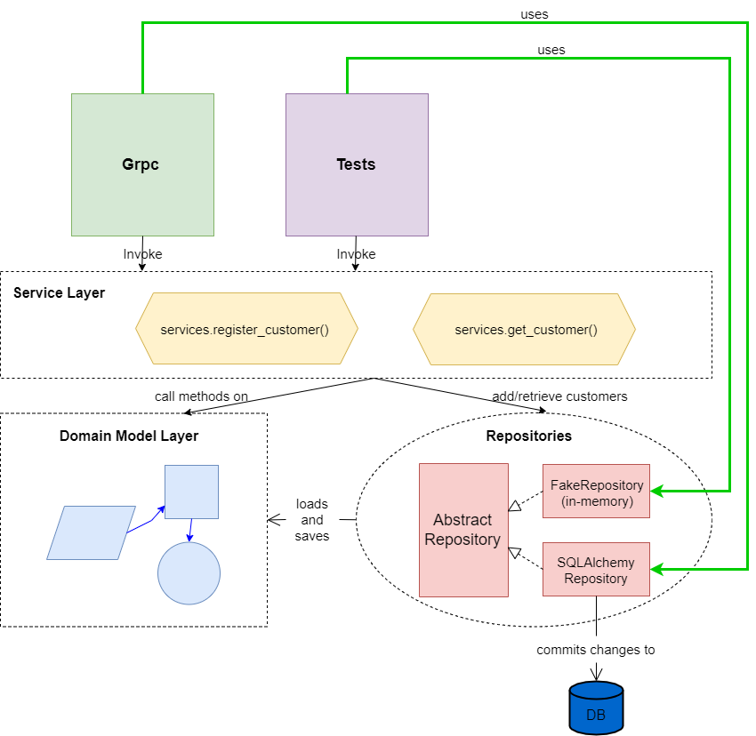

# Example application code for microservices with python, grpc, docker and kubernetes
the goal of this example is mainly to learn and test grpc, docker and kubernetes. So to keep things manageable, I defined only two microservices:
1. **Customer**: is a microservice that registers a new customer and performs basic CRUD operations around the customer.
2. **Payment**: is a microservice that basically executes a payment, and some CRUD operations related to it.
The payment microservice interacts with the customer microservice to retrieve information about the customer. 

## Requirements
* Optionally a local python 3.9 virtualenv 
* docker with docker-compose

## Building the containers
- make build
- make up\
**OR**
- make all # builds and brings containers up

## Creating a local virtualenv (optional)

python3.9 -m venv .venv && source .venv/bin/activate
1. cd customer
2. pip install -r requirements.txt
3. pip install -e src/

Repeat same steps (from 1 to 3) for payment microservice.

## Using secrets for docker containers
Among the best practices, it's recommended to use secrets to protect sensitive data such as database credentials.
You'll find a file named 'password.txt' under customer and payment folders, that's aimed to contain the postgres database password. Put yours there.
check 'docker-compose.yml' to see how to use secrets.\
In real world applications, such files **MUST NOT BE COMMITTED** to subversion control. It's just there for demo purposes. 

## Architecture diagram

We adopted database per service pattern.

## Project structure
### customer and payment folders
We put each microservice in a separate directory/package.
### protobuf folder
**GRPC** is the inter-service communication framework which was selected, to allow our services to talk to each other. 
GRPC uses the fast HTTP/2 binary protocol, and also makes use of Google’s Protocol Buffers. The idea here was to have a central place for all service definitions/proto files. 
As this is just a small demo project, we put all proto files inside a folder. For bigger projects, a common practice is to store them in a central Git repository.
### kubernetes folder
TODO

## Component diagram for the microservices
We designed both microservices internally the same way.
We applied two key design patterns : 
- The **repository pattern**: is an abstraction over data storage. It decouples the domain model layer from the data layer making the system more testable and hiding the complexities of the database. 
- The **service layer pattern**: the role of service layer is to separate **'stuff that talks http or http/2'** from **'stuff that talks domain models'**. 
It's also known as **orchestration pattern** because it orchestrates operations and workflows of the system. 
Typical service layer functions/classes performs the following steps:
    1. Fetching stuff out of the repository.
    2. Validating the input and making assertions about the request against the current database state.
    3. Calling a service.
    4. If everything works well, save/update the new state.

This resulted in having **4 layers** for each microservice:

    - Domain models layer
    - Repository layer
    - Service layer
    - API layer
   

